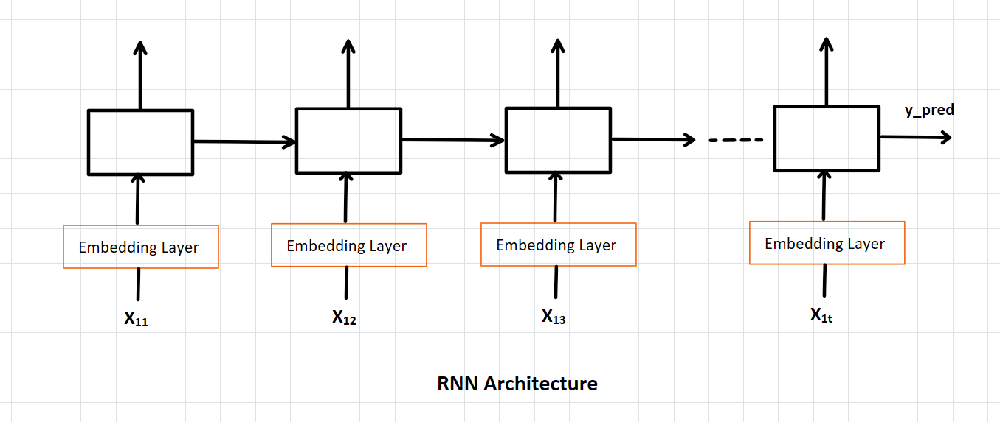
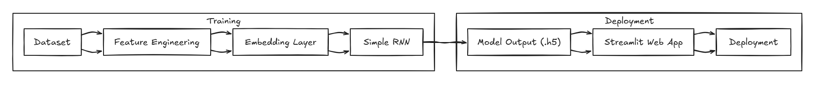

# End-to-End Deep Learning Project: Sentiment Analysis using Simple RNN

## 📌 Problem Statement
Sentiment analysis is a fundamental NLP task that classifies text into categories such as **positive** or **negative** sentiment.  
This project builds an **end-to-end deep learning pipeline** using a **Simple Recurrent Neural Network (RNN)** to analyze movie reviews from the IMDB dataset.  

The objectives are:
- Preprocess raw text reviews into numerical sequences.
- Train a Simple RNN model for binary sentiment classification.
- Save the trained model for reuse.
- Deploy the model via a **Streamlit web application** for real-time inference.

<br/>

## 📊 Dataset Description
We use the **IMDB Movie Reviews Dataset**, a benchmark dataset for sentiment analysis.

- **Source**: IMDB dataset (available via Keras datasets).
- **Size**: 50,000 movie reviews.
- **Classes**:  
  - Positive reviews  
  - Negative reviews
- **Split**:  
  - Training set: 25,000 reviews  
  - Test set: 25,000 reviews
- **Format**: Text reviews with binary sentiment labels.

<br/>

## RNN Architecture



<br/>

## ⚙️ Environment Setup
We leverage **Google Colab** for model training, taking advantage of free GPU resources.

### Prerequisites
- Python 3.8+
- TensorFlow / Keras
- NumPy, Pandas
- Matplotlib, Seaborn
- Streamlit (for deployment)

### Steps
1. **Clone Repository**
   ```bash
   git clone https://github.com/your-username/deep-learning-projects.git
   cd deep-learning-projects/SimpleRNN-SentimentAnalysis
   ```

2. **Install Dependencies**
   ```bash
   pip install -r requirements.txt
   ```

3. **Run on Google Colab**
   - Upload the notebook to Google Colab.
   - Enable GPU runtime (`Runtime > Change runtime type > GPU`).
   - Execute cells step by step to train and evaluate the model.

4. **Deployment Setup**
   - Save the trained model as `.h5` file.
   - Build a **Streamlit web app** to serve predictions.
   - Deploy locally or on cloud platforms (Heroku, Streamlit Cloud, etc.).

<br/>

## 🚀 Workflow Overview



<br/>

## 📈 Expected Outcome
- A trained **Simple RNN model** capable of classifying IMDB reviews into **positive** or **negative** sentiment.
- A **Streamlit web application** that allows users to input text and receive real-time sentiment predictions.
- End-to-end reproducibility from dataset preparation → training → deployment.

